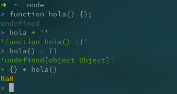

# Tutorial de NodeJS y Markdown

## ¿Qué es NodeJS?
Es un intérprete **Javascript** del lado del servidor que cambia la noción de cómo debería trabajar un servidor. Su meta es permitir a un programador construir aplicaciones altamente escalables y escribir código que maneje decenas de miles de conexiones simultáneas en una sólo una máquina física.

## Instalación de NodeJS en linux
Para llevar a cabo la instalación de *NodeJS* en linux se puede proceder de diversas maneras; se puede optar por instalarlo via gestionardor de paquetes
de la distro que se usa puede no estar(En mi caso uso Antergos, una variante de [Archlinux](https://www.archlinux.org/)) o por medio del binario que se puede descargar en la [página oficial](https://nodejs.org/en/).

Yo he optado por usar el gestionador de paquetes.
```bash
sudo pacman -Syu nodejs
```

## Uso de NodeJS

Para iniciar el REPL(Read-Eval-Print-Loop) de Javascript incorporado en NodeJS, ejecutamos node en un terminal del sistema. Con ello ya podemos interpretar
código Javascript directamente. Como se muestra:


Para complementar el lenguaje están las [librerias ya existentes](https://www.npmjs.com), estas pueden ser obtenidas con el comando `npm` el cual viene con el paquete de NodeJS ya instalado.

Antes de comenzar a instalar los paquetes se debe hacer diversas configuraciones para evitar instalar los paquetes como administrador usando `sudo`. Les recomiendo seguir los siguientes pasos explicados de forma resumida, pero que pueden encontrar en esta [dirección](https://github.com/sindresorhus/guides/blob/master/npm-global-without-sudo.md)

- Crear un directorio para los paquetes a instalar globalmente

> `mkdir "${HOME}/.npm-packages"`

- Indicar a `npm` en su archivo de configuración `~/.npmrc` donde se localiza el directorio a guardar los paquetes globales. Añadiendo la siguiente línea

> `prefix=${HOME}/.npm-packages`

- Debemos modificar nuestro archivo de configuración de la shell que se usa, en mi caso uso `ZSH`. Con lo cual es `~/.zshrc` pero si fuese bash seria `~/.bashrc`

~~~~~bash
NPM_PACKAGES="${HOME}/.npm-packages"

PATH="$NPM_PACKAGES/bin:$PATH"

# Unset manpath so we can inherit from /etc/manpath via the `manpath` command
unset MANPATH # delete if you already modified MANPATH elsewhere in your config
export MANPATH="$NPM_PACKAGES/share/man:$(manpath)"
~~~~~

- Por último para cargar los cambios podemos ejecutar `source ~/.bashrc` en el caso de tener bash como shell. Los cambios se van a cargar cada vez que se inicie
la shell correspondiente.

Como recomendación les propongo instalar [grunt](https://www.npmjs.com/package/grunt-cli) y [express](http://expressjs.com/).

- Grunt: Permite automatizar tareas

> `npm install -g grunt-cli`

- Express: TODO:

> `npm install -g express`


**Comando**

> `npm install express --save`


## Instalación del editor de texto Atom

Usaremos **Atom** como editor de texto para el desarrollo de nuestros proyectos, para ello descargamos el instalador en la página oficial de atom, y a continuación ejecutamos el asistente de instalación.


Dado que vamos a utilizar el formato **Markdown** es bueno saber que en **Atom** podremos obtener una preview del contenido de nuestro fichero Markdown ya que incorpora el formato **GitHub Markdown** con el comando:

**Comando**

> * Markdown preview `ctrl+shift+m`
> * Markdown export to HTML `Save As HTML`


## Instalación de GitHub Desktop

GitHub es una plataforma para alojar proyectos utilizando el sistema de control de versiones **Git**. Para instalarlo accedemos a la página oficial de **GitHub** y descargamos el instalador que ejecutaremos posteriormente para iniciar el asistente de instalación.


Una vez instalado configuramos nuestra cuenta de **GitHub** en la aplicación para poder sincronizar nuestro repositorio tanto local como remoto, en caso de no tener cuenta crearemos una en la página de **GitHub**.

## Cloud 9

Es un IDE de desarrollo online, para su uso será necesario crear una cuenta en la página oficial o acceder con las credenciales de GitHub si ya se dispone de una cuenta. Una vez registrados podremos crear proyectos de varias tecnologías como puede ser NodeJS, HTML5, C++, Ruby On Rails, etc.


Si disponemos de algún proyecto en un repositorio de GitHub podremos asociarlo a **Cloud9** para trabajar en él tan solo creando un “`nuevo workspace`” y añadiendo la url *git* del correspondiente repositorio.


Además **Cloud9** permite el trabajo en equipo en el IDE añadiendo miembros a tu workspace.

## Markdown

Markdown es un lenguaje de marcado ligero, lo vamos a utilizar en el editor de texto Atom ya que incorpora por defecto este formato y podremos obtener un live preview mientras vamos desarrollando además de poder exportarlo a HTML sin la necesidad de usar un conversor adicional.

Sintaxis:


Encabezados
```
# Encabezado H1
## Encabezado H2
### Encabezado H3
```
Tipografía
```
**Negrita**
*Cursiva*
> Citas
Parrafo separar por lineas en blanco
`Codigo`
```
Recursos
```

* [Links](https://example.com)
```
Listas
```
1. Lista 1
2. Lista 2

* Lista 1
* Lista 2
```

**Recursos:**

* [NodeJS](https://nodejs.org)
* [Express](http://expressjs.com)
* [NodeJs sudo info](http://stackoverflow.com/questions/16151018/npm-throws-error-without-sudo)
* [NodeJs sudo info 2](https://github.com/sindresorhus/guides/blob/master/npm-global-without-sudo.md)
* [Atom IDE](https://atom.io)
* [GitHub Desktop](https://desktop.github.com)
* [GitHub Pages](https://pages.github.com/)
* [Cloud 9 IDE](https://c9.io)
* [Markdown](http://daringfireball.net/projects/markdown/)
* [Resultado del Markdown HTML](http://alu0100536652.github.io/Tutorial-STW/)
